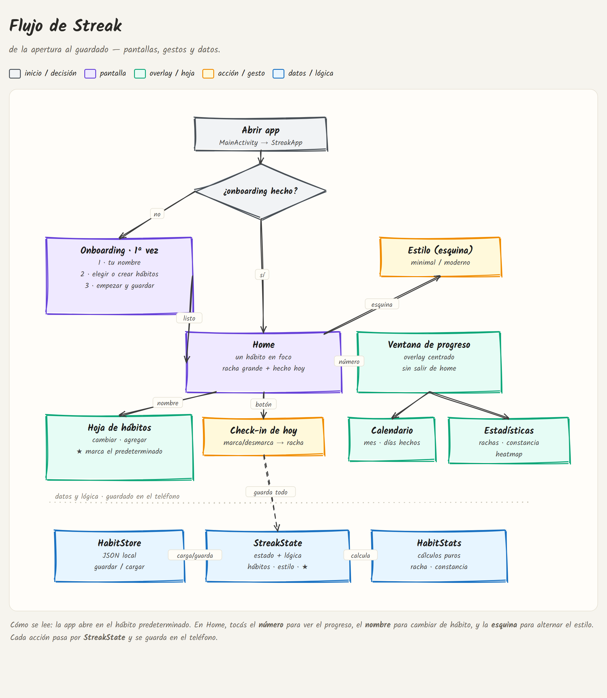

<h1 align="center">🔥 Streak</h1>

<em>Build consistency — one day at a time.</em>

  
  
  
  
  

---

**Streak** is a minimalist Android app for tracking daily habits.
No accounts. No ads. No cloud. Just your streak.

## Philosophy

Streak isn't about motivation — it's about **consistency**.
One habit in focus, one tap a day. The home screen never becomes a cluttered
to‑do list: your habits live one swipe away.

## Features

- ✅ **Daily check-in** with an automatic streak counter
- 🎯 **One focused habit** on the home screen — calm by design
- 🧩 **Home-screen widget** in three sizes — mark today, a minimalist dot calendar,
  or a mini interactive app
- 🔔 **Nightly reminder (22:00)** with quick *"did you do it?"* actions
- 🎉 **Streak messages** — congratulations on milestones, encouragement after a slip
- 🔊 **Subtle sound** when you check in
- 🚀 **First-run onboarding** — enter your name and pick or create habits
- 🪟 **Progress overlay** — tap the streak number for a centered calendar + stats window
- ⭐ **Default habit** — choose which habit opens on launch
- 🎨 **Two switchable styles** from a corner toggle — *Minimal* (default, black &
  white) and *Modern* (Material 3, color, emoji)
- 💾 **Safe local storage** — automatic backup keeps your data across updates
- 📴 **Offline-first** — your data stays on your device
- 🆓 **Open source**

## App flow

  

<em>From launch to save — screens, gestures and the data layer.</em>

Editable source: <a href="docs/streak-flow.excalidraw"><code>docs/streak-flow.excalidraw</code></a> — open it at <a href="https://excalidraw.com">excalidraw.com</a>.

## Roadmap

- [x] Project setup (Kotlin · Compose · Material 3)
- [x] Home screen with streak counter
- [x] Multiple habits + bottom sheet + add-habit dialog
- [x] Modern / Minimal interface styles
- [x] Local persistence (JSON on device)
- [x] Calendar view
- [x] Statistics & consistency charts
- [x] Onboarding, corner style toggle & progress overlay
- [x] Home-screen widget, nightly reminders & streak messages
- [ ] Room-backed storage
- [ ] Release v1.0

## Tech stack

| Layer | Choice |
| --- | --- |
| Language | Kotlin |
| UI | Jetpack Compose + Material 3 |
| Architecture | MVVM (state holder → ViewModel) |
| Persistence | Local JSON file with auto-backup *(Room planned)* |
| Dates & stats | `java.time` + pure Kotlin |
| Widget | Jetpack Glance |
| Reminders | WorkManager + notifications |
| Min / Target SDK | 26 / 36 |

## Download

Grab the latest debug APK from the
**[Releases](https://github.com/Antitastico/Streak/releases)** page and open it
on your Android device. You may need to allow *"Install unknown apps"* for your
browser or file manager.

## Build & run

Clone the repository and open it in Android Studio, let Gradle sync, then press
**Run**. To build a debug APK from the command line:

    ./gradlew assembleDebug

The APK is generated at `app/build/outputs/apk/debug/app-debug.apk`.

## Project structure

    app/src/main/java/io/github/antitastico/streak/
    ├── MainActivity.kt      # Entry point, notification permission + reminder
    ├── StreakApp.kt         # Theme + onboarding/home routing, reload on resume
    ├── StreakState.kt       # State holder: habits, selection, style
    ├── Habit.kt             # Habit model + UiStyle enum
    ├── HabitStats.kt        # Pure functions: streaks, consistency, charts
    ├── HabitStore.kt        # Local JSON persistence with auto-backup
    ├── audio/
    │   └── SoundFx.kt        # Check-in sound (SoundPool)
    ├── notify/              # Nightly reminder + streak messages
    │   ├── Notifications.kt      # Channel + notification builders
    │   ├── ReminderScheduler.kt  # Daily 22:00 schedule (WorkManager)
    │   ├── ReminderWorker.kt     # Decides reminder / congrats / encouragement
    │   └── HabitActionReceiver.kt# Notification action buttons
    ├── widget/              # Home-screen widget (Jetpack Glance)
    │   ├── StreakWidget.kt       # Small / medium / large layouts
    │   └── StreakWidgetReceiver.kt
    └── ui/theme/
        ├── HomeScreen.kt     # Home + habit sheet + add dialog
        ├── OnboardingScreen.kt # First-run onboarding
        ├── CalendarScreen.kt # Monthly calendar
        ├── StatsScreen.kt    # Stats, bar chart & heatmap
        ├── Theme.kt          # Modern / Minimal themes
        ├── Color.kt          # Color palette
        └── Type.kt           # Thin, delicate typography

## License

Released under the terms described in [LICENSE.md](LICENSE.md).
